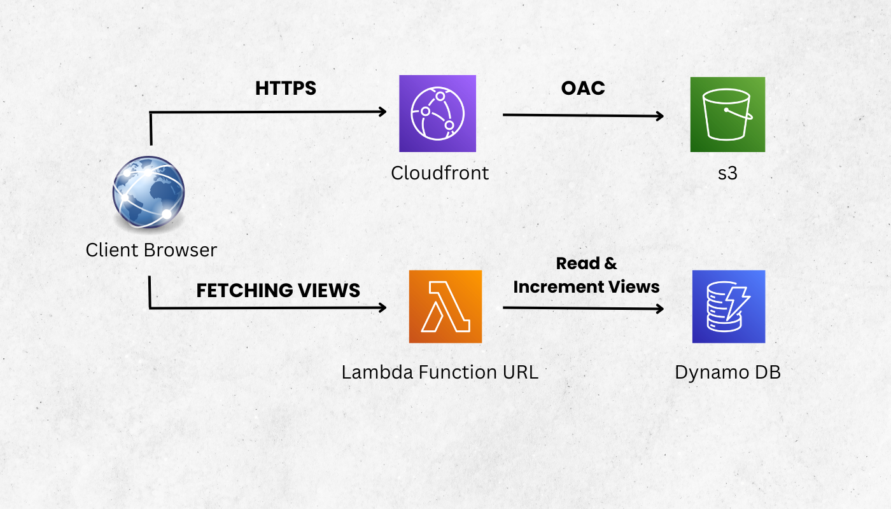

# Cloud Resume Challenge

  

This repository contains the **Cloud Resume Project**, a serverless, full-stack application showcasing modern DevOps and AWS best practices. It hosts a personal resume site on AWS S3 and CloudFront, tracks page views with DynamoDB and Lambda, and automates infrastructure and deployments using Terraform and GitHub Actions.

---

## Table of Contents

1. [Project Overview](#project-overview)  
2. [Technologies](#technologies)  
3. [Live Demo](#live-demo)  

---

## Project Overview

This project includes:

- A static resume site hosted on **S3**, delivered through **CloudFront**  
- A visitor counter built using **AWS Lambda** (Python) and **DynamoDB**  
- Fully provisioned infrastructure using **Terraform**  
- Automated deployment using **GitHub Actions** for both frontend and backend  

It was an amazing way to get hands-on with AWS, serverless tech, and DevOps workflows.

---

## Technologies

- **AWS S3 & CloudFront** – for static site hosting and secure CDN  
- **AWS Lambda (Python 3.8)** – API backend for visitor count  
- **DynamoDB** – stores visit data  
- **Terraform** – Infrastructure as Code  
- **GitHub Actions** – CI/CD pipelines  
- **HTML/CSS/JavaScript** – Frontend stack  

---

## Live Demo

> **https://mrsinghincloud.com**

You can visit the site to see my resume and watch the visitor counter in action — powered entirely by AWS serverless services.

---

